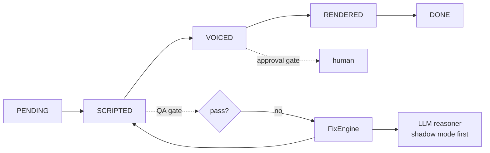

# sleepy-agent

A small agentic AI system built in public, from scratch, in Go. No agent
framework. The goal is to learn what actually works when an AI system has to
reason, use tools, make decisions and take action, and to share the
architecture, the failures and the trade-offs along the way.

The code is being extracted piece by piece from Sleepy, my own project that
already produces sleep-narration videos, and wrapped in an agent layer. The
running example is an automated episode pipeline: a topic goes in, an
episode (title, script, later narration and video) comes out, with quality
gates, self-healing and human approval where it matters.

> Status: **Day 3 of 10.** The agent loop, tools, a `Decider` and a Groq
> provider exist. The episode pipeline is still the naive Day 2 version; the
> real state machine is ported from Sleepy on Day 4.

## Run it

Needs Go 1.23 or newer. No API key, no network.

```bash
make demo   # the agent loop; scripted mock, or a real model if GROQ_API_KEY is set
make test   # tests with the race detector
make lint   # gofmt and go vet
```

## Where this is going



Design rules the code will follow:

- **One seam to the model.** Everything talks to `llm.Provider`. The mock,
  Groq and OpenAI are interchangeable, and tests never need a network.
- **Deterministic first.** Rules live in code (QA gates, fix catalog), not in
  prompts. The LLM only handles judgment calls that cannot be coded.
- **Earn autonomy.** A new capability starts in shadow mode, where it only
  suggests. It gets control after the logs show it deserves it.
- **Act, ask, stop.** Every step has an explicit rule for when the agent
  proceeds, asks a human, or halts.
- **Publish safely.** `Voice`, `Renderer` and `Publisher` are interfaces with
  mocks. The publisher defaults to dry-run; a real upload is unlisted and needs
  approval. Nothing goes public without an explicit autonomy policy.

## Plan (living, it changes when something fails)

| Day | Focus |
| --- | --- |
| 1 to 2 | Launch, repo, provider seam, mock provider, first measured failure |
| 3 | Agent loop, tools with validation, `Decider` (act, ask, stop), Groq provider |
| 4 | State machine and worker loop ported from Sleepy; walking skeleton with mock adapters |
| 5 | QA gates ported; first real LLM pipeline; the known gap tests flip to reject |
| 6 | Idempotency and FixEngine; a `Store` interface (in memory or file first, Postgres optional later) |
| 7 | Shadow-mode LLM reasoner and evals |
| 8 | Approval gates, autonomy levels, guardrails (budget, attempts, allow-list) |
| 9 | Real voice, render and YouTube adapters, first real upload as unlisted behind approval |
| 10 | Launch: CI, Docker compose, one-command demo, walkthrough |

Every day's failures are written down in [FAILURE_LOG.md](FAILURE_LOG.md).

## License

MIT
