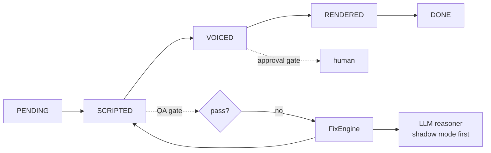

# sleepy-agent

A small agentic AI system built in public, from scratch, in Go. No agent
framework. The goal is to learn what actually works when an AI system has to
reason, use tools, make decisions and take action, and to share the
architecture, the failures and the trade-offs along the way.

The running example is an automated episode pipeline: a topic goes in, an
episode (title, script, later narration and video) comes out, with quality
gates, self-healing and human approval where it matters.

> Status: **Day 2 of 15.** Scaffold, provider interface and a mock provider.
> The pipeline is intentionally naive; it gets replaced by a real state
> machine on Day 5.

## Run it

Needs Go 1.23 or newer. No API key, no network.

```bash
make demo   # one end-to-end run with the mock provider
make test   # tests with the race detector
make lint   # gofmt and go vet
```

## Where this is going



Design rules the code will follow:

- **One seam to the model.** Everything talks to `llm.Provider`. The mock,
  Groq and OpenAI are interchangeable, and tests never need a network.
- **Deterministic first.** Rules live in code (QA gates, fix catalog), not in
  prompts. The LLM only handles judgment calls that cannot be coded.
- **Earn autonomy.** A new capability starts in shadow mode, where it only
  suggests. It gets control after the logs show it deserves it.
- **Act, ask, stop.** Every step has an explicit rule for when the agent
  proceeds, asks a human, or halts.

## Plan

| Days | Focus |
| --- | --- |
| 2 to 6 | Provider seam, agent loop, tools and validation, state machine, first real LLM |
| 7 to 11 | QA gates, idempotent retries, FixEngine, shadow-mode LLM reasoner, evals |
| 12 to 15 | Approval gates and autonomy levels, guardrails, CI and demo, launch |
| Bonus | Concurrency experiment: serial versus parallel on the same golden set |

Every day's failures are written down in [FAILURE_LOG.md](FAILURE_LOG.md).

## License

MIT
