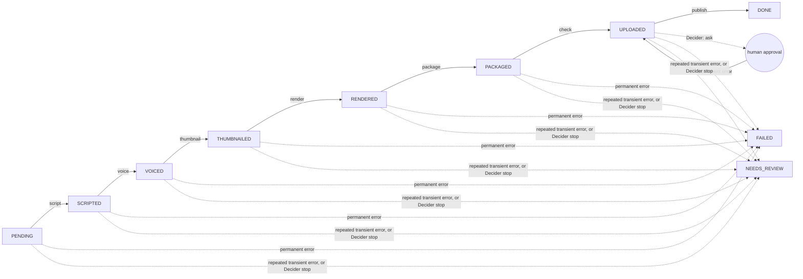

# sleepy-agent

A small agentic AI system built in public, from scratch, in Go. No agent
framework. The goal is to learn what actually works when an AI system has to
reason, use tools, make decisions and take action, and to share the
architecture, the failures and the trade-offs along the way.

The code is being extracted piece by piece from Sleepy, my own project that
already produces sleep-narration videos, and wrapped in an agent layer. The
running example is an automated episode pipeline: a topic goes in, an
episode (title, script, later narration and video) comes out, with quality
gates, self-healing and human approval where it matters.

> Status: **Day 4 of 11.** The state machine and worker loop are ported from
> Sleepy, and a walking skeleton runs a mock episode end to end. Publishing
> waits for a human. The script step still uses the naive Day 2 generator, QA
> gates are ported on Day 6.

## Run it

Needs Go 1.23 or newer. No API key, no network.

```bash
make skeleton # one mock episode through the state machine, publish waits for approval
make demo     # the agent loop; scripted mock, or a real model if GROQ_API_KEY and GROQ_MODEL are set
make compare  # native vs prompt based tool calling, N runs each (needs GROQ_API_KEY and GROQ_MODEL for a real result)
make test     # tests with the race detector
make lint     # gofmt and go vet
```

## How a run moves

One worker iteration claims a run, does exactly one step, and releases it. The
status is the only memory, so a crashed run resumes from the step it was on
(tested by reopening the state file with brand new objects).



Not built yet, but where it goes: QA gates after each step (Day 6), a fix
engine for failed gates (Day 7 and 8), budgets and autonomy levels (Day 9).

Design rules the code follows:

- **One seam to the model.** Everything talks to `llm.Provider`. The mock,
  Groq and OpenAI are interchangeable, and tests never need a network.
- **Deterministic first.** Rules live in code (QA gates, fix catalog), not in
  prompts. The LLM only handles judgment calls that cannot be coded.
- **Earn autonomy.** A new capability starts in shadow mode, where it only
  suggests. It gets control after the logs show it deserves it.
- **Act, ask, stop.** Before every step the worker asks an `agent.Decider`.
  There is no implicit permission, and an unknown answer means stop.
- **Publish safely.** `Voice`, `Renderer` and `Publisher` are interfaces with
  mocks. The publisher defaults to dry-run; a real upload is unlisted and needs
  approval. Nothing goes public without an explicit autonomy policy.

## Repo layout

| Package | What it does | From Sleepy? |
| --- | --- | --- |
| `internal/agent` | Agent loop, tool schemas and validation, `Decider` (act, ask, stop) | new |
| `internal/llm` | `Provider` seam, mock, OpenAI compatible client (Groq) with native tool calling, `PromptTools` adapter for models without it | new |
| `internal/tools` | Tools the agent can call: policy, word count, repetition | new |
| `internal/domain` | Run model and the status chain | ported |
| `internal/runner` | Worker loop, approval gate, adapter interfaces and mocks | ported, reduced |
| `internal/store` | Run storage: memory or JSON file | new (Sleepy uses Postgres) |
| `internal/policy`, `internal/errs` | Duration limits, transient error type | ported |
| `internal/pipeline` | Naive Day 2 script generator, replaced on Day 5 | new, temporary |
| `internal/scenario` | The one task `demo` and `compare` share, so both measure the same thing | new |
| `cmd/demo`, `cmd/skeleton`, `cmd/compare` | The agent loop demo, the walking skeleton, the adapter comparison | new |

## Known limits (measured, see FAILURE_LOG.md)

- The script step is the naive Day 2 generator and the mock always returns the
  same text. Nothing checks quality yet, QA gates arrive on Day 6.
- Tool calling is model specific, measured with `make compare` (5 runs per
  mode, one task, so not a reliability claim). `gpt-oss-20b` and `gpt-oss-120b`:
  native 5/5, prompt based 0/5 (HTTP 400 on Groq). `qwen/qwen3.8-27b`: 5/5 in
  both modes, native used about 1.9x the tokens (3241 vs 1718 per run). The
  cause of the token difference is not measured.
- A step that crashes in the middle is run again from its start. Idempotency
  (input hashes) arrives on Day 7.

## Plan (living, it changes when something fails)

| Day | Focus |
| --- | --- |
| 1 to 2 | Launch, repo, provider seam, mock provider, first measured failure |
| 3 | Agent loop, tools with validation, `Decider` (act, ask, stop), Groq provider |
| 4 | State machine, worker loop and a `Store` (memory or JSON file) ported from Sleepy; walking skeleton with mock adapters and a publish approval gate |
| 5 | Real script generation: Sleepy's script generator ported, the script step runs on a real LLM; first measured raw failure rate, with no QA yet |
| 6 | QA gates ported; the known gap tests flip to reject |
| 7 | Idempotency (input hashes) and FixEngine; Postgres behind `Store` only if needed |
| 8 | Shadow-mode LLM reasoner and evals |
| 9 | Approval gates, autonomy levels, guardrails (budget, attempts, allow-list) |
| 10 | Real voice, render and YouTube adapters, first real upload as unlisted behind approval |
| 11 | Launch: CI, Docker compose, one-command demo, walkthrough |

Every day's failures are written down in [FAILURE_LOG.md](FAILURE_LOG.md).

## License

MIT
